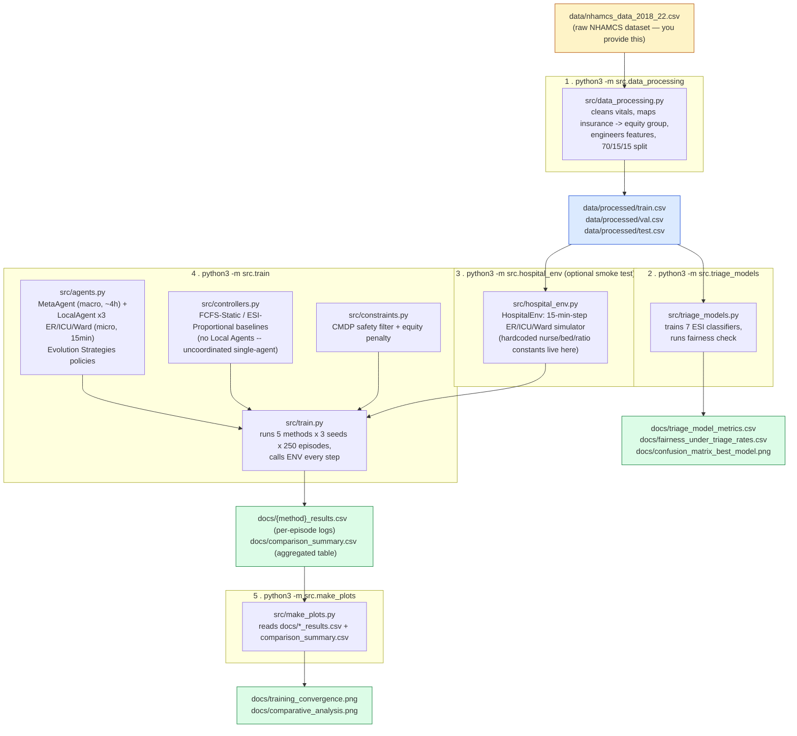

# Pipeline: what runs, in what order, producing what

Run each command from the repo root with the venv active. This diagram
shows the full chain from raw CSV to final plots — arrows are "produces /
feeds into."

## Reading order (what to run, in what sequence)

| Step | Command | Reads | Writes | Time |
|---|---|---|---|---|
| 1 | `python3 -m src.data_processing` | `data/nhamcs_data_2018_22.csv` | `data/processed/{train,val,test}.csv` | ~few sec |
| 2 | `python3 -m src.triage_models` | `data/processed/*.csv` | `docs/triage_model_metrics.csv`, `docs/fairness_under_triage_rates.csv`, `docs/confusion_matrix_best_model.png` | ~5-10s |
| 3 | `python3 -m src.hospital_env` | `data/processed/train.csv` | nothing — just prints a smoke test | instant |
| 4 | `python3 -m src.train` | `data/processed/train.csv`, imports `agents.py`, `controllers.py`, `constraints.py`, `hospital_env.py` | `docs/{method}_results.csv`, `docs/comparison_summary.csv` | ~9-10 min |
| 5 | `python3 -m src.make_plots` | `docs/*_results.csv`, `docs/comparison_summary.csv` | `docs/training_convergence.png`, `docs/comparative_analysis.png` | instant |

## Where the hospital's "real world" numbers live

All of it is in one place — `src/hospital_env.py`, `HospitalEnv.__init__` —
and one constant in `src/train.py`:

- `er_ratio_limit`, `icu_ratio_limit`, `ward_ratio_limit` — patients per nurse allowed before the safety filter blocks an allocation
- `er_nurses_base`, `icu_nurses_base`, `ward_nurses_base` — fixed staffing each department always has
- `total_float_nurses` — the pool of nurses the `MetaAgent` allocates across departments every ~4 hours
- `daily_arrivals` (set in `src/train.py`, passed into `HospitalEnv`) — average patients/day driving the Poisson arrival process

There is no doctor count or equipment (X-ray, imaging, etc.) modeled anywhere
in this codebase — only nurse staffing and the bed capacity implied by it.
Changing these constants and re-running step 4 (`src.train`) retrains all
agents from scratch against the new numbers; nothing else needs editing.

For the HC-MARL methods, each department also has its own `LocalAgent`
(`src/agents.py`) that decides every 15 minutes which of its own boarding
patients get admitted first (a learned `equity_priority` tie-break among
patients of equal ESI severity). Admission *volume* is not learned — the
environment always admits as many patients as the Meta-Agent-derived,
Safety-Filter-verified capacity allows that step, which is what makes
ICU/Ward overcrowding via admission structurally impossible rather than
merely discouraged.
